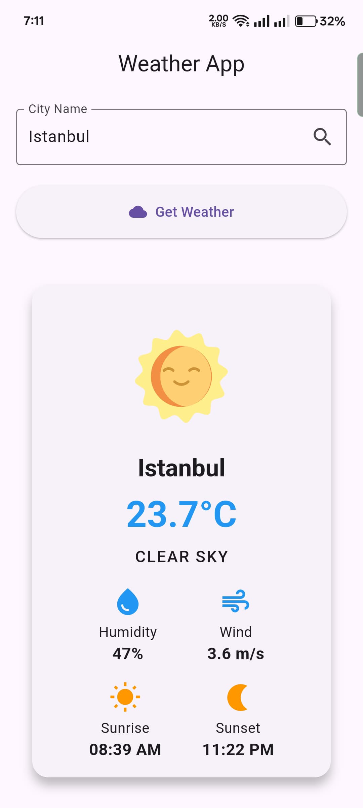
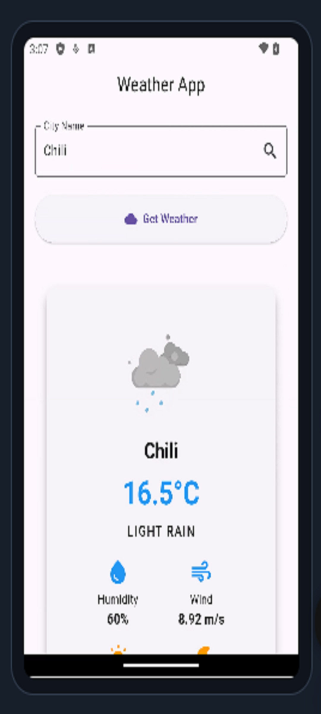

# 🌦️ Weather App

A beautiful, responsive weather application built with Flutter that displays current weather conditions using OpenWeatherMap API.

## ✨ Features

- **Real-time Weather Data** - Get current weather for any city worldwide
- **Elegant UI** - Clean, modern interface with gradient backgrounds
- **Detailed Metrics** - Temperature, humidity, wind speed, sunrise/sunset times
- **Weather Animations** - Lottie animations for different weather conditions
- **Responsive Design** - Works on both mobile and tablet devices
- **Error Handling** - User-friendly error messages

## 🛠️ Technical Stack

- **Framework**: Flutter (Dart)
- **State Management**: Built-in setState
- **API**: OpenWeatherMap
- **Animation**: Lottie
- **Dependencies**:
  - http: ^1.1.0
  - lottie: ^3.3.0
  - intl: ^0.18.1

## 📱 App Screenshots

| Home Screen | Screenshot-1 | Screenshot-2 | Screenshot-3 |
|-------------|-------------|-------------|-------------|
|  |  |  | | 

## 🚀 Installation

1. **Clone the repository**
   ```bash
   git clone https://github.com/meahadi-hasan/Weather-App.git
   cd Weather-App
